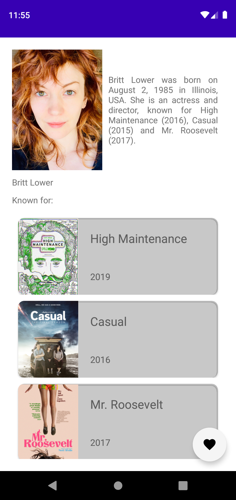

## A native Android mobile app for barcode generating (in progress)

A native Android mobile app which allows to browse TV shows and movies using IMDB API.

## Done:
 - various lists eg. of most popular tv shows/movies
 - title details (poster, score, description, trailer link, actors list)
 - actor details (photo, bio, list of known for titles)
 - sign in option using Google Authenticator
 - saving titles and actors as favourites ones (offline using RoomDB, online via Firebase)

## To do:
- list of favourite titles/actors
- reading of favourite items from Firebase 
- deletion of favourite items from Firebase 

|||
|--|--|

|||
|--|--|

|

|
|--|