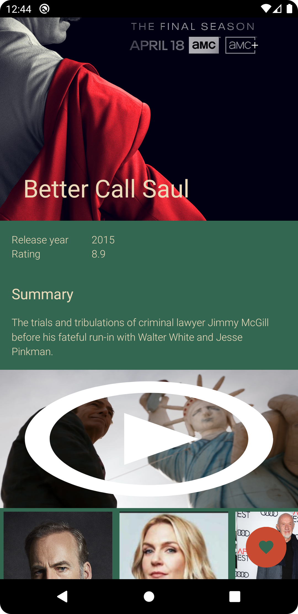
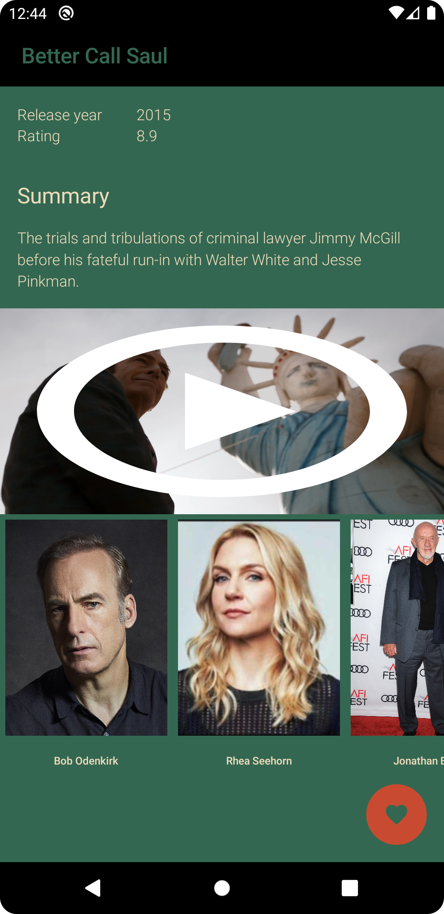

## A native Android mobile app which allows to browse TV shows and movies using IMDB API

 - various lists eg. of most popular tv shows/movies (images loaded by Glide)
 - title details (poster, score, description, trailer link, actors list)
 - title trailer thumbnail which opens video in a browser
 - actor details (photo, bio, list of known for titles)
 - sign in option using Google Authenticator
 - saving/deletion titles and actors as favourites ones (offline using RoomDB or online via Firebase)
 - list of favourite titles/actors
 - title search functionality
 - no internet connection alerts

|||
|--|--|

|||
|--|--|

|||
|--|--|

|||
|--|--|

|||
|--|--|

|||
|--|--|
